# kotlinMvvmDemo

**ViewModel + LiveData + Koin + 协程 + Retrofit**

### 什么是MVVM
MVVM（Model–view–viewmodel）是一种软件架构模式。
    
### 框架的主要构成

- #### 包结构
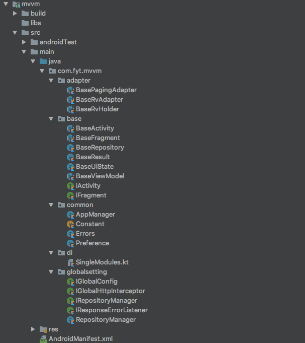

- #### base
	- 框架结构
	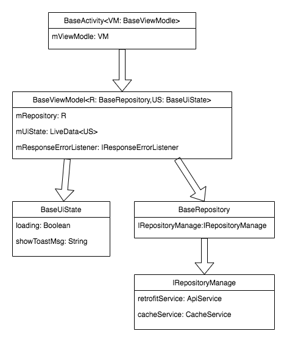
	
	- BaseRepository //封装服务器请求及返回
	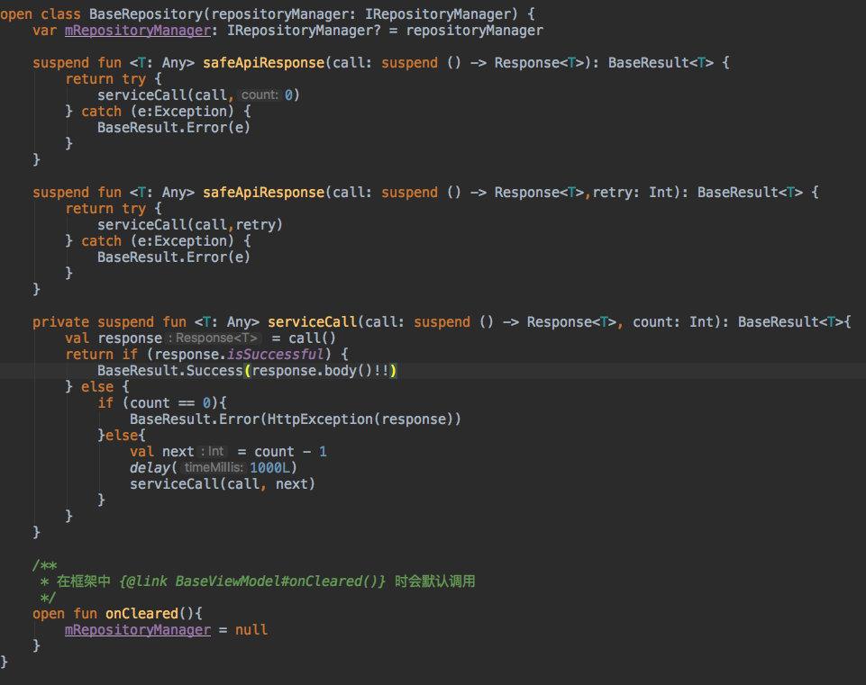
	- BaseViewModel //封装请求操作及LiveData数据同步方法
	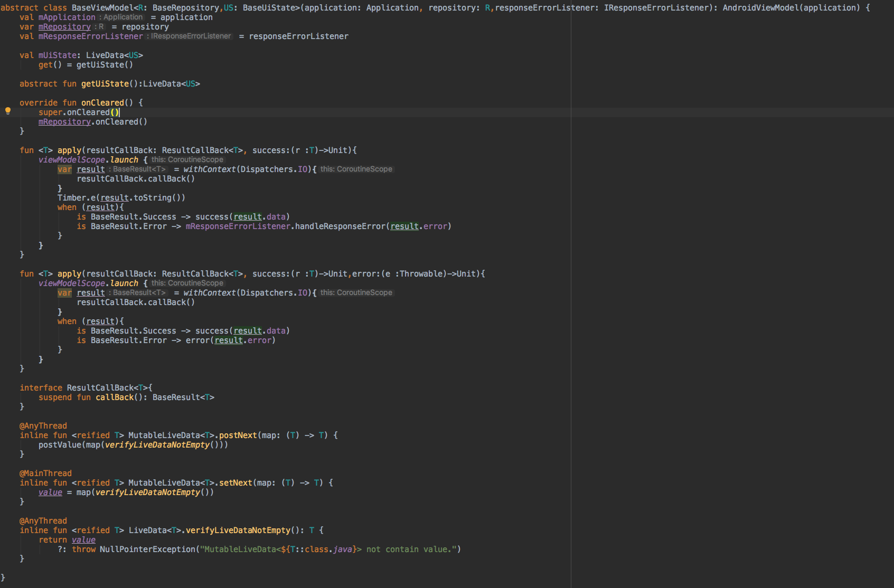

- #### di
	- Gson
	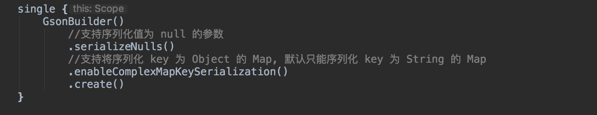

    - OkHttp
    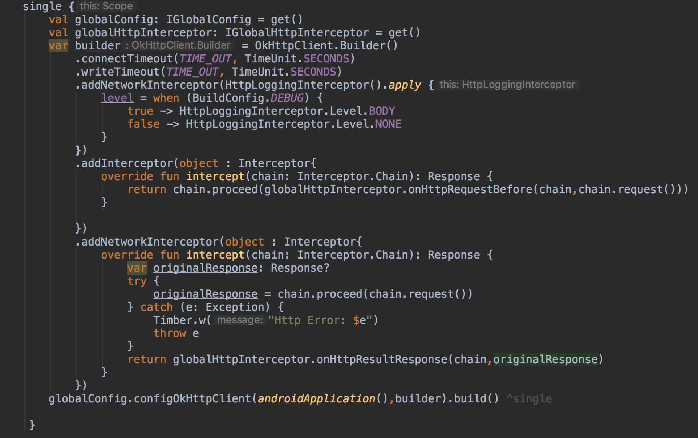

    - Retrofit
    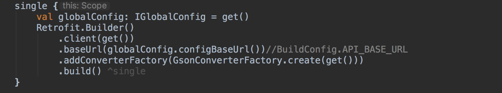
	
	- IRepositoryManager 
	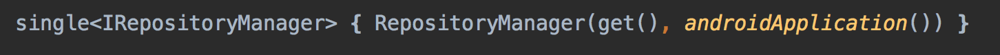

- #### globalSetting
	- IGlobalConfig //全局的配置
	    - configBaseUrl()
	    - configOkHttpClient()
	- IGlogbalHttpInterceptor //处理 Http 请求和响应结果的处理类,可做添加token、token失效刷新等处理
		- onHttpResultResponse()
		- onHttpRequestBefore()
	- IReposeErrorListener //全局异常统一处理类
		- handleResponseError(t: Throwable)
	- IRepositoryManage //管理网络请求层以及数据缓存层
		 - obtainRetrofitService()
         - obtainCacheService()
### 如何使用该框架
	
1. 实现 IGlobalConfig
	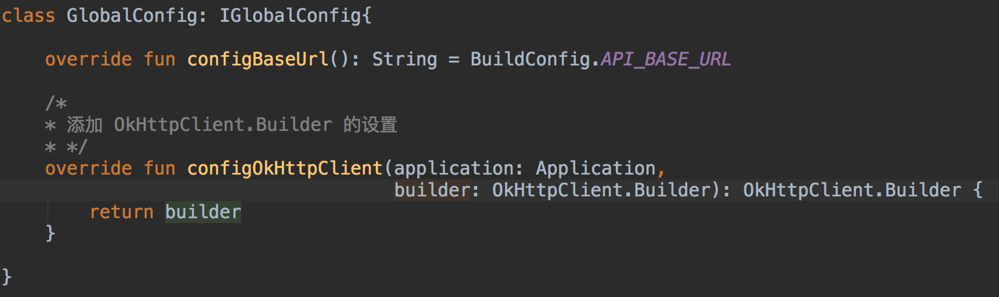
	
2. 实现 IGlogbalHttpInterceptor
	 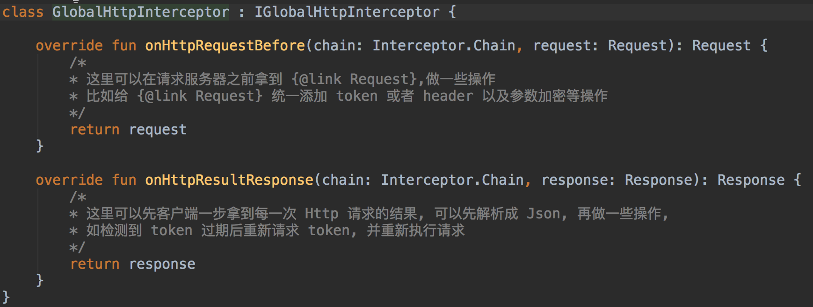

3. 实现 IResponseErrorListener
 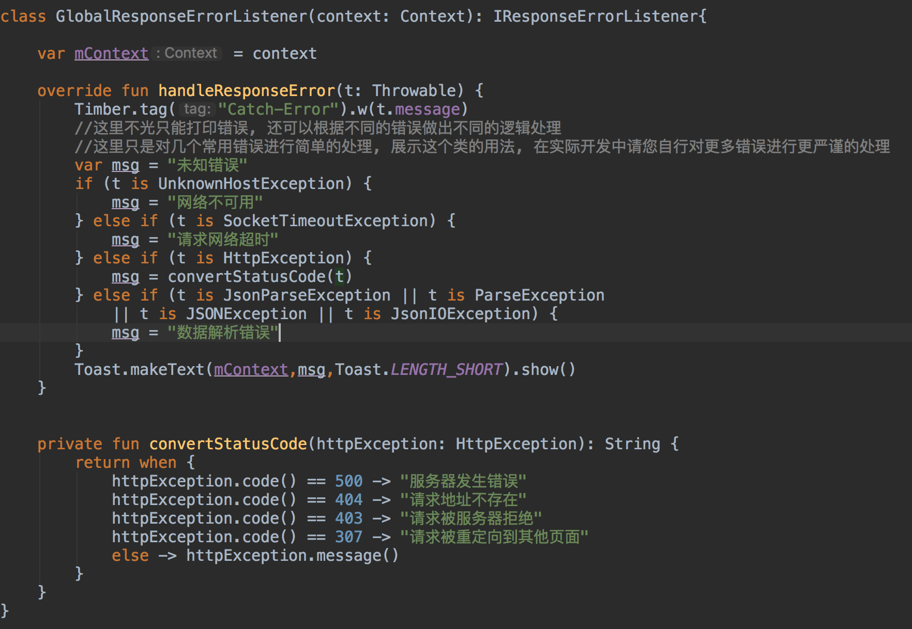
 
4. 注入以上实现 
	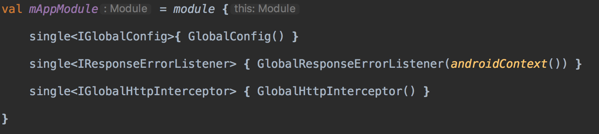

5. 在Appliction 的onCreate() 中启动注入
	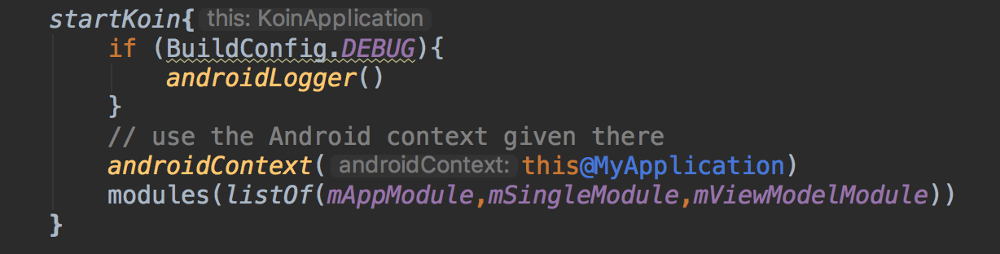

