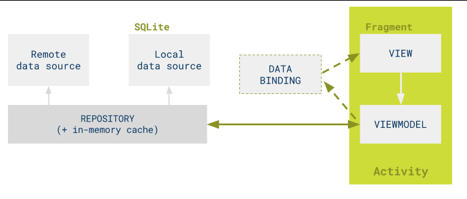

# kotlinMvvmDemo

**ViewModel + LiveData + DataBinding + Hilt + 协程 + Retrofit**


本框架遵循上图设计，设计理念是用尽可能少的封装做到让开发变的快捷、简单的同时输出稳定、安全又统一的代码。
本框架的所有配置都可以通过外部配置，外部实现IGlobalConfiguration 通过 @Binds 注入到框架中

### 使用框架

1.1.  创建MyApplication 并添加@HiltAndroidApp 注解
```kotlin
@HiltAndroidApp
class MyApplication: Application() {

    override fun onCreate() {
        super.onCreate()

        if (BuildConfig.DEBUG) {
            LeakCanary.install(this)
            Timber.plant(Timber.DebugTree())
        }
        Preference.setContext(applicationContext)
    }


    override fun onTrimMemory(level: Int) {
        super.onTrimMemory(level)
        // clear Glide cache
        if (level == ComponentCallbacks2.TRIM_MEMORY_UI_HIDDEN) {
            Glide.get(this).clearMemory()
        }
        // trim memory
        Glide.get(this).trimMemory(level)
    }

    override fun onLowMemory() {
        super.onLowMemory()
        // low memory clear Glide cache
        Glide.get(this).clearMemory()
    }
}
```

1.2. 实现 IGlobalConfiguration、IGlobalHttpInterceptor、IResponseErrorListener、IView

```kotlin
class GlobalConfigurationImpl @Inject constructor(@ApplicationContext val content: Context) :IGlobalConfiguration{
    override fun configBaseUrl(): String = "https://www.wanandroid.com/"

    override fun configGson(builder: GsonBuilder) {

    }

    override fun configOkHttpClient(builder: OkHttpClient.Builder) {
        builder
            .writeTimeout(3000, TimeUnit.MILLISECONDS)
            .connectTimeout(3000, TimeUnit.MILLISECONDS)
            .readTimeout(3000, TimeUnit.MILLISECONDS)
    }

    override fun configRetrofit(builder: Retrofit.Builder) {
    }
}

class GlobalHttpInterceptorImpl @Inject constructor() : IGlobalHttpInterceptor {

    override fun onHttpRequestBefore(chain: Interceptor.Chain, request: Request): Request {
        /*
        * 这里可以在请求服务器之前拿到 {@link Request},做一些操作
        * 比如给 {@link Request} 统一添加 token 或者 header 以及参数加密等操作
        */
        return request
    }

    override fun onHttpResultResponse(chain: Interceptor.Chain, response: Response): Response {
        /*
        * 这里可以先客户端一步拿到每一次 Http 请求的结果, 可以先解析成 Json, 再做一些操作,
        * 如检测到 token 过期后重新请求 token, 并重新执行请求
        */
        return response
    }
}


class GlobalResponseErrorListenerImpl @Inject constructor(@ApplicationContext context: Context): IResponseErrorListener{

    var mContext = context

    override fun handleResponseError(t: Throwable) {
        Timber.tag("Catch-Error").w(t.message)
        //这里不光只能打印错误, 还可以根据不同的错误做出不同的逻辑处理
        //这里只是对几个常用错误进行简单的处理, 展示这个类的用法, 在实际开发中请您自行对更多错误进行更严谨的处理
        var msg = "未知错误"
        if (t is UnknownHostException) {
            msg = "网络不可用"
        } else if (t is SocketTimeoutException) {
            msg = "请求网络超时"
        } else if (t is HttpException) {
            msg = convertStatusCode(t)
        } else if (t is JsonParseException || t is ParseException
            || t is JSONException || t is JsonIOException) {
            msg = "数据解析错误"
        }
        Toast.makeText(mContext,msg,Toast.LENGTH_SHORT).show()
    }


    private fun convertStatusCode(httpException: HttpException): String {
        return when {
            httpException.code() == 500 -> "服务器发生错误"
            httpException.code() == 404 -> "请求地址不存在"
            httpException.code() == 403 -> "请求被服务器拒绝"
            httpException.code() == 307 -> "请求被重定向到其他页面"
            else -> httpException.message()
        }
    }
}

class IViewImpl @Inject constructor() : IView {
    private var progressDialog: ProgressDialog? = null

    override fun showLoading(context: Context) {
        if (progressDialog == null) {
            progressDialog = ProgressDialog(context)
        }
        progressDialog?.show()
    }

    override fun hideLoading() {
        progressDialog?.dismiss()
    }

    override fun showMessage(context: Context, message: String) {
        Toast.makeText(context, message, Toast.LENGTH_SHORT).show()
    }

}

```

1.3. 添加GlobalModule 注入以上实现
```kotlin
@Module
@InstallIn(SingletonComponent::class)
abstract class GlobalModule {
    @Binds
    abstract fun provideIGlobalConfiguration(impl: GlobalConfigurationImpl):IGlobalConfiguration

    @Binds
    abstract fun provideIGlobalHttpInterceptor(impl: GlobalHttpInterceptorImpl): IGlobalHttpInterceptor

    @Binds
    abstract fun provideIResponseErrorListener(impl:GlobalResponseErrorListenerImpl):IResponseErrorListener

    @Binds
    abstract fun provideIView(impl: IViewImpl): IView
}
```
到这里框架的配置已经完成，接下来就能使用了

2.1. 创建自己的Activity/Fragment 继承BaseActivity/BaseFragment 并添加@AndroidEntryPoint 注解
```kotlin
@AndroidEntryPoint
class LoginFragment: BaseFragment<LoginViewModel,FragmentLoginBinding>(){
    override fun layoutId(): Int = R.layout.fragment_login

    override fun initData(savedInstanceState: Bundle?) {

        observer(mViewModel.loginUiState){
            if(it.loginSuc){
                findNavController().navigate(R.id.action_loginFragment_to_mainFragment)
            }
        }
        mDataBinding.btnLogin.setOnClickListener {
            val account = mDataBinding.etAccount .text.toString()
            val password = mDataBinding.etPassword.text.toString()
            if (TextUtils.isEmpty(account)){
                showMessage("账号不能为空")
                return@setOnClickListener
            }
            if (TextUtils.isEmpty(password)){
                showMessage("密码不能为空")
                return@setOnClickListener
            }
            mViewModel.login(account,password)
        }
    }

    override fun onDestroy() {
        super.onDestroy()
        hideLoading()
    }
}
```
2.2. 创建自己的ViewModel 继承BaseViewModel 并添加@HiltViewModel 注解
```kotlin
@HiltViewModel
class LoginViewModel @Inject constructor(application: Application,
    repository: WanAndroidRepository,
    responseErrorListener: IResponseErrorListener
) : BaseViewModel<WanAndroidRepository>(application, repository, responseErrorListener) {

    var loginUiState = MutableLiveData<LoginUiState>()

    fun login(username:String, password:String) {
        showLoading.postValue(true)
        apply(object :ResultCallBack<BaseResponse<UserBean>>{
            override suspend fun callBack(): BaseResult<BaseResponse<UserBean>> {
                return mRepository.login(username,password)
            }
        },{
            showLoading.postValue(false)
            if(it.errorCode == 0){
                Preference.preferences.edit()
                    .putString("username",username)
                    .putString("password",password)
                    .apply()
                loginUiState.postValue(LoginUiState(loginSuc = true))
            }else{
                showToastMsg.postValue( it.errorMsg)
            }

        },{
            showToastMsg.postValue("登录失败")
            mResponseErrorListener.handleResponseError(it)
        })
    }
}
```
2.3. 创建自己的Repository 继承BaseRepository
```kotlin
class WanAndroidRepository(repositoryManager: IRepositoryManager): BaseRepository(repositoryManager){

    suspend fun login(username: String, password: String): BaseResult<BaseResponse<UserBean>> {
        return safeApiResponse(call = {
            mRepositoryManager!!.obtainRetrofitService(WanAndroidApi::class.java)
                .login(username, password)
        })
    }

    suspend fun register(username: String, password: String, repassword: String): BaseResult<BaseResponse<UserBean>> {
        return safeApiResponse(call = {
            mRepositoryManager!!.obtainRetrofitService(WanAndroidApi::class.java)
                .register(username, password,repassword)
        })
    }

}
```
2.4 添加ViewModelModule 类，注入自己的Repository 
```kotlin
@Module
@InstallIn(ViewModelComponent::class)
class ViewModelModule {

    @ViewModelScoped
    @Provides
    fun provideWanAndroidRepository(repositoryManager: IRepositoryManager): WanAndroidRepository {
        return WanAndroidRepository(repositoryManager)
    }
}
```

以上完成配置及使用。都很简单，配置主要是实现配置接口并注入到框架中。使用则是继承Base类添加自己的实现。
使用的注入框架为Hilt 没使用过的同学可以看这里[Hilt 的使用以及遇到的问题](https://juejin.cn/post/6953883719954382878)
